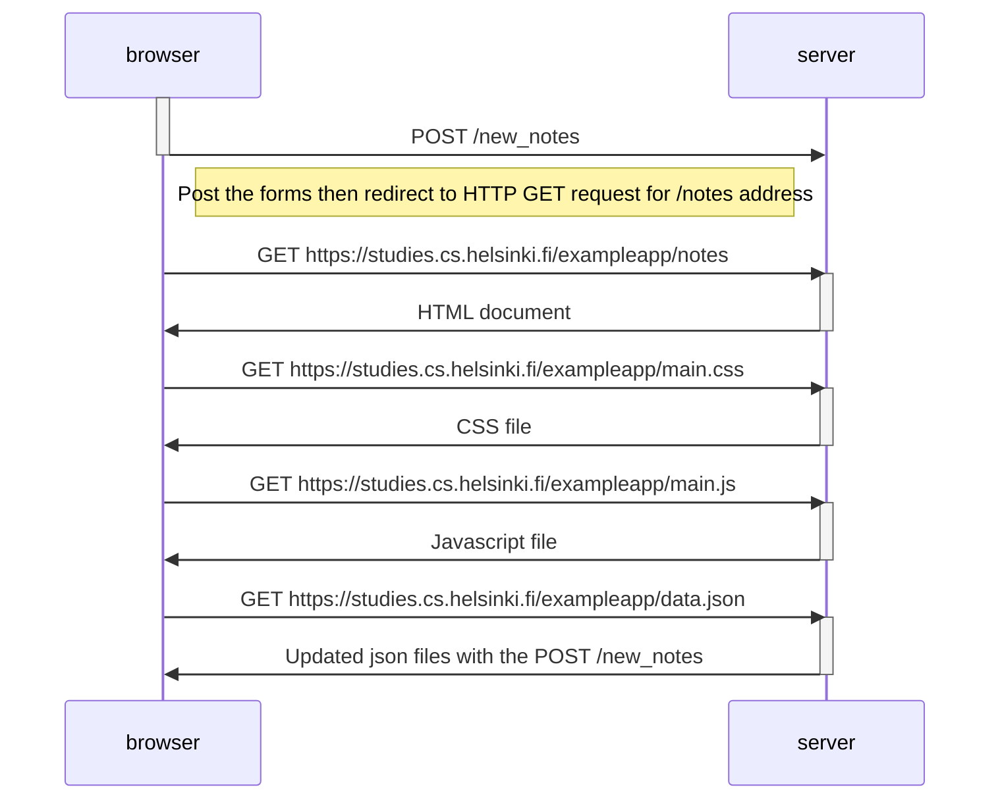

```mermaid
sequenceDiagram
    participant browser
    participant server

    activate browser
    browser->>server: POST /new_notes
    deactivate browser

    Note right of browser: Post the forms then redirect to HTTP GET request for /notes address

    browser->>server: GET https://studies.cs.helsinki.fi/exampleapp/notes
    activate server
    server->>browser: HTML document
    deactivate server

    browser->>server: GET https://studies.cs.helsinki.fi/exampleapp/main.css
    activate server
    server->>browser: CSS file
    deactivate server

    browser->>server: GET https://studies.cs.helsinki.fi/exampleapp/main.js
    activate server
    server->>browser: Javascript file
    deactivate server

    browser->>server: GET https://studies.cs.helsinki.fi/exampleapp/data.json
    activate server
    server->>browser: Updated json files with the POST /new_notes
    deactivate server
```