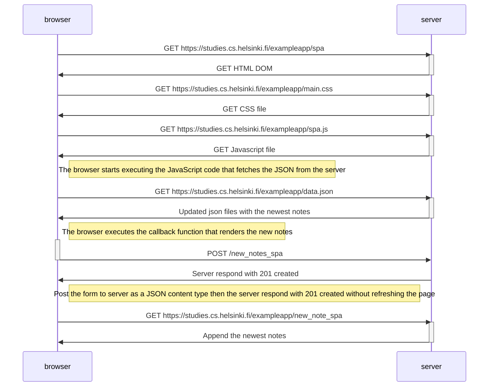

```mermaid
sequenceDiagram
    participant browser
    participant server

    browser->>server: GET https://studies.cs.helsinki.fi/exampleapp/spa
    activate server
    server->>browser: GET HTML DOM
    deactivate server

    browser->>server: GET https://studies.cs.helsinki.fi/exampleapp/main.css
    activate server
    server->>browser: GET CSS file
    deactivate server

    browser->>server: GET https://studies.cs.helsinki.fi/exampleapp/spa.js
    activate server
    server->>browser: GET Javascript file
    deactivate server

    Note right of browser: The browser starts executing the JavaScript code that fetches the JSON from the server

    browser->>server: GET https://studies.cs.helsinki.fi/exampleapp/data.json
    activate server
    server->>browser: Updated json files with the newest notes
    deactivate server

    Note right of browser: The browser executes the callback function that renders the new notes

    activate browser
    browser->>server: POST /new_notes_spa
    deactivate browser
    server->>browser: Server respond with 201 created

    Note right of browser: Post the form to server as a JSON content type then the server respond with 201 created without refreshing the page

    browser->>server: GET https://studies.cs.helsinki.fi/exampleapp/new_note_spa
    activate server
    server->>browser: Append the newest notes
    deactivate server
```